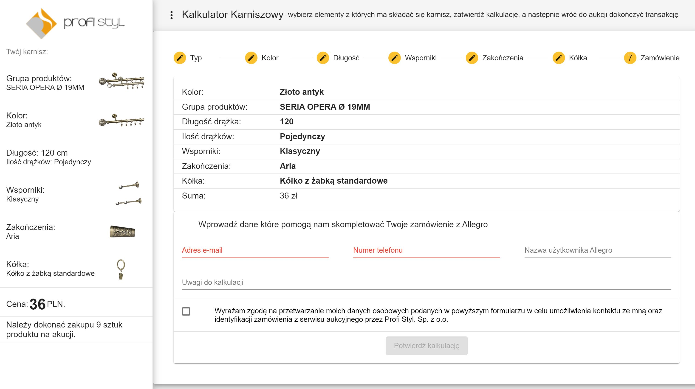
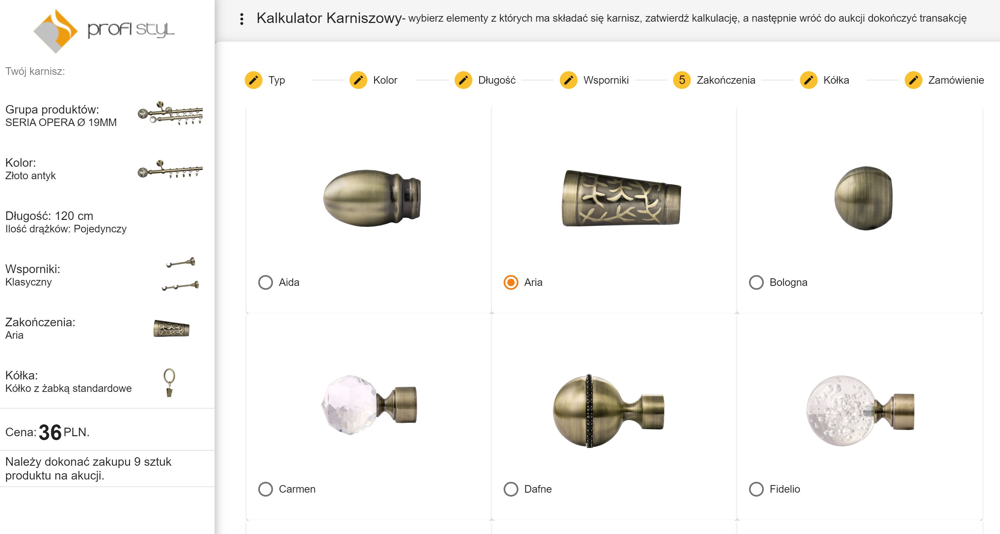

# Curtain Rod Calculator - shop

Application that allows you to configure the curtain rod from the available elements. After the calculation is completed, 
client confirms all details and is instructed how to order the curtain rod on Allegro service. E-mail with these instructions
and order summary is sent after confirmation. 

The client is redirected to the website (http://kalkulator.profi-styl.pl/) from an Allegro auction, with required parameters.
These parameters allows to prepare correct calculation and redirect him back to complete order.

